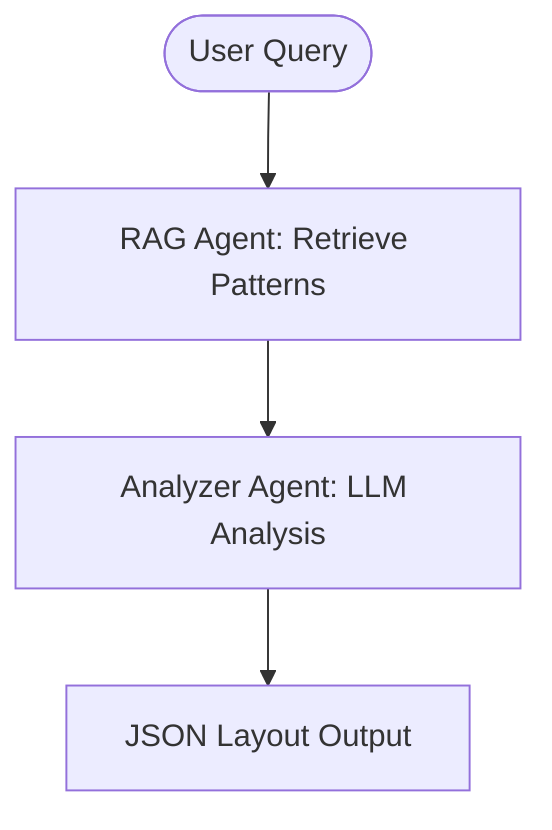

# Design System Layout Agent

**Transform natural language queries into structured JSON layouts** — A pure JSON Layout specification system powered by LLM and RAG.

## 🎯 What is This?

The Design System Layout Agent translates user queries like "show me my leads" or "account summary" into structured JSON layouts. It **never generates code** — only JSON specifications that describe UI layouts with components, data, and actions.

## ✨ Key Features

- 🤖 **LLM-Powered Analysis**: Uses GPT-4/Claude to understand intent
- 📚 **RAG Integration**: Retrieves relevant patterns from knowledge base
- 🎨 **JSON-Only Output**: Pure layout specifications, no code generation
- 🔀 **Multi-Agent System**: Built with LangGraph for orchestration
- 🎯 **Intent-Based Layouts**: Automatically maps queries to appropriate layouts
- 🧩 **Composable Components**: Card, List, Table, KPI, Badge, and more

## 🏗️ Architecture



**2-Agent Workflow:**
1. **RAG Agent**: Retrieves relevant layout patterns from documents
2. **Analyzer Agent**: Uses LLM to generate JSON layout specification

## 📦 Project Structure

```
design_system_agent/
├── agent/
│   ├── core/
│   │   ├── rag_engine.py      # RAG retrieval system
│   │   └── llm_client.py      # LLM interactions (JSON Layout Agent)
│   ├── graph_agent.py         # LangGraph multi-agent orchestrator
│   └── agent_controller.py    # Main API interface
├── api/
│   └── router.py              # FastAPI endpoints
└── documents/                 # RAG knowledge base
```

## 🚀 Quick Start

### 1. Environment Setup

```bash
# Create conda environment
conda create -n design-system-agent python=3.11
conda activate design-system-agent

# Install dependencies
pip install -r requirements.txt
```

### 2. Set API Keys (Optional)

```bash
# For OpenAI
export OPENAI_API_KEY=sk-...

# For Anthropic
export ANTHROPIC_API_KEY=sk-ant-...
```

> Without API keys, the system runs in **mock mode** with predefined responses.

### 3. Start the Server

```bash
uvicorn design_system_agent.api.main:app --reload
```

Server runs at: `http://127.0.0.1:8000`

## 💡 Usage Examples

### Python API

```python
from design_system_agent.agent.graph_agent import DesignSystemGraph

graph = DesignSystemGraph()

# LIST query
result = graph.process("show me my leads")
print(result["layout"])
# Returns: Table layout with columns, actions, utilities

# SUMMARY query
result = graph.process("show me account summary")
print(result["layout"])
# Returns: Dashboard with KPIs and Card

# DETAIL query
result = graph.process("show account details")
print(result["layout"])
# Returns: Card with key-value data
```

### HTTP API

```bash
# List view
curl -X POST http://localhost:8000/generate \
  -H "Content-Type: application/json" \
  -d '{"query": "show me my leads"}'

# Summary view
curl -X POST http://localhost:8000/generate \
  -H "Content-Type: application/json" \
  -d '{"query": "account summary"}'
```

## 📋 JSON Schema

All outputs follow this structure:

```json
{
  "query": "show me my leads",
  "outcome": {
    "intent": "list",
    "layout": "table",
    "components": [
      {
        "type": "table",
        "title": "Leads",
        "columns": ["Name", "Company", "Status"],
        "data": [],
        "actions": ["view", "edit"],
        "utility": ["search", "filter", "pagination"]
      }
    ]
  }
}
```

## 🎨 Component Types

| Type | Use Case | Example |
|------|----------|---------|
| **card** | Detail views | Account details, Profile |
| **list** | Simple listings | Tasks, Notifications |
| **table** | Structured data | Leads, Users, Transactions |
| **kpi** | Metrics & stats | Dashboard KPIs, Analytics |
| **badge** | Status indicators | Active/Inactive, Priority |
| **section** | Content grouping | Page sections |
| **text** | Headings & labels | Titles, Descriptions |
| **button** | Actions | Submit, Cancel, Export |

## 🎯 Layout Decision Rules

| Query Intent | Layout Type | Components |
|--------------|-------------|------------|
| **summary** | dashboard | KPI + Card |
| **detail** | card | Card |
| **list** | list/table | List or Table |
| **table** | table | Table |
| **dashboard** | grid | Multiple KPIs |

## 📚 Documentation

- **[JSON Layout Agent Guide](./JSON_LAYOUT_AGENT.md)** - Complete specification
- **[API Documentation](http://localhost:8000/docs)** - Interactive API docs (when server is running)

## 🧪 Testing

```bash
# Run all tests
pytest

# Test specific queries
python -c "
from design_system_agent.agent.graph_agent import DesignSystemGraph
import json

graph = DesignSystemGraph()
result = graph.process('show me my leads')
print(json.dumps(result['layout'], indent=2))
"
```

## 🔧 Development

### Add RAG Documents

Place design system patterns in `design_system_agent/agent/documents/`:

```
documents/
├── table_patterns.md
├── dashboard_patterns.md
└── form_patterns.md
```

### Customize LLM Prompts

Edit [llm_client.py](design_system_agent/agent/core/llm_client.py) to modify the system prompt and layout decision rules.

## 🎓 Key Principles

1. **JSON Only** - Never generate code, HTML, or React
2. **Strict Schema** - Always follow the exact JSON structure  
3. **Key-Value Data** - All data as object properties, never arrays
4. **Intent-Based** - Layout decisions based on query analysis
5. **Composable** - Mix components for complex layouts
6. **Backend Agnostic** - Works with any frontend framework

## 🔄 Migration from Code Generation

| Before (v1) | After (v2) |
|-------------|-----------|
| Generated React/HTML code | Returns JSON layouts |
| 4 agents | 2 agents (simplified) |
| Format parameter (react/html) | Always JSON |
| Code templates | Layout decision rules |
| ContextualGenerator | Pure LLM analysis |

## 🤝 Contributing

Contributions welcome! Please read the contributing guidelines first.

## 📄 License

MIT License - see LICENSE file for details

## 🙏 Acknowledgments

- Built with [LangGraph](https://github.com/langchain-ai/langgraph) for multi-agent orchestration
- Powered by [LangChain](https://github.com/langchain-ai/langchain) ecosystem
- API framework: [FastAPI](https://fastapi.tiangolo.com/)

